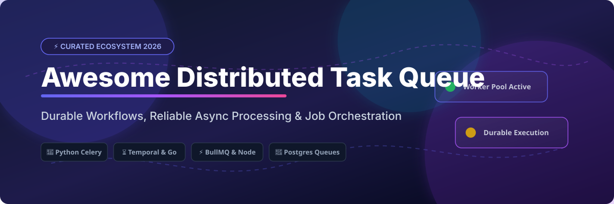

  

# 🚀 Awesome Distributed Task Queue

  
  
  
  

A curated, SEO-optimized directory of SaaS products and open-source GitHub projects for **Distributed Task Queues**, durable workflows, background job processors, and async execution engines. ⚙️

Focused on background jobs, durable workflows, reliable async execution, retries, rate limiting, and orchestration for modern distributed microservices and event-driven architectures. 🛠️

**Last updated: September 2026** 📅

---

## 📋 Table of Contents

- [📈 Market Size & Industry Dynamics](#-market-size--industry-dynamics)
- [☁️ SaaS & Managed Platforms](#%EF%B8%8F-saas--managed-platforms)
- [🔓 Open-Source GitHub Projects](#-open-source-github-projects)
- [🏗️ Architecture & Use Case Guide](#%EF%B8%8F-architecture--use-case-guide)
- [🤝 How to Contribute](#-how-to-contribute)
- [💖 Support & Sponsorship](#-support--sponsorship)
- [⚠️ Disclaimer](#%EF%B8%8F-disclaimer)
- [📈 Star History](#-star-history)

---

## 📈 Market Size & Industry Dynamics

> 💡 **Estimated Market Size & Industry Concentration:**  
> The global market for distributed task queues, durable execution, and workflow orchestration infrastructure is estimated at **$4.5B – $6.0B** (2026), growing at over 22% CAGR driven by enterprise cloud migration, microservices, and LLM agent orchestration. The sector is **moderately fragmented**: while commercial giants (like Google Cloud Tasks and AWS SQS) and Category Leaders (such as Temporal Cloud valued at $12.55B) command substantial market share in mission-critical workflows, rapid open-source innovation (BullMQ, Hatchet, Restate, Inngest, Asynq) ensures strong developer competition across multi-language ecosystems rather than a winner-take-all monopoly.

---

## ☁️ SaaS & Managed Platforms

Commercial task queues and hosted durable workflow engines provide zero-ops scalability, built-in observability, and enterprise reliability guarantees. Sorted by company size (valuation / revenue / market cap, descending): 📊

| Platform | Starting Tier Price | Free Tier Limit / Trial | Valuation / Revenue / Company Size | Description |
| :--- | :--- | :--- | :--- | :--- |
| **[Google Cloud Tasks](https://cloud.google.com/tasks)** 🌐 | $0.40 / 1 Million operations | 1,000,000 operations free per month | **$2.4+ Trillion** (Alphabet Inc. Market Cap) | Managed HTTP-based task queue service built for Google Cloud infrastructure with asynchronous task dispatch and retries. |
| **[Temporal Cloud](https://temporal.io/)** ⏳ | $100 / month (Essentials Base) | $150 free usage credits ($6,000 for eligible startups) | **$12.55 Billion** Valuation ($250M+ ARR) | Managed durable execution platform offering code-as-workflow reliability guarantees for critical business workflows. |
| **[Trigger.dev](https://trigger.dev/)** ⚡ | $10 / month (Hobby Tier) | $5 free monthly usage credits | **$19 Million** Total Funding raised | Developer-friendly background job framework built for TypeScript with zero timeouts and real-time execution observability. |
| **[Inngest Cloud](https://www.inngest.com/)** 🔄 | $25 / month (Pro Tier) | 50,000 executions & 500,000 events / month | **$34 Million** Total Funding raised ($2.5M+ ARR) | Event-driven background job platform enabling complex async workflows without server infrastructure management. |
| **[Restate Cloud](https://restate.dev/)** 🛡️ | Usage-based after free limits | Free tier with ~50,000 actions / month | **$27 Million** Total Funding raised | Serverless durable execution and resilient state management framework for event-driven systems and microservices. |
| **[Upstash QStash](https://upstash.com/docs/qstash/overall/whatisqstash)** 🚀 | $180 / month (Standard Tier) or $1 per 100K msgs | 1,000 messages / day free | **$12 Million** Total Funding raised | Serverless HTTP-based message queue and job scheduler designed specifically for serverless and edge runtimes. |
| **[Hatchet Cloud](https://hatchet.run/)** 🪓 | $500 / month (Team Tier) | 100,000 task runs / month free | **~$440K** Estimated ARR (Seed / YC W24) | High-throughput distributed background task runner and durable workflow engine backed by PostgreSQL. |

---

## 🔓 Open-Source GitHub Projects

Leading open-source distributed task queues, background job runners, and durable execution frameworks. Sorted by GitHub Stars_Count (descending): ⭐

| Project | GitHub_Stars | Language / Broker | Primary Focus & Feature Highlights |
| :--- | :--- | :--- | :--- |
| **[Celery](https://github.com/celery/celery)** 🐍 |  | Python / Redis, RabbitMQ | Classic distributed task queue for Python powering production applications with complex routing and workflows. |
| **[Temporal](https://github.com/temporalio/temporal)** ⏳ |  | Go, Multi-SDK / Cassandra, Postgres, MySQL | Leading durable execution system offering workflows as code, saga patterns, automatic state preservation, and retries. |
| **[Asynq](https://github.com/hibiken/asynq)** 🐹 |  | Go / Redis | Distributed task queue for Go inspired by Sidekiq, featuring priority queues, task deduplication, and scheduled jobs. |
| **[Sidekiq](https://github.com/sidekiq/sidekiq)** 💎 |  | Ruby / Redis | Simple, efficient background processing framework for Ruby applications using multi-threading to handle millions of jobs. |
| **[RQ (Redis Queue)](https://github.com/rq/rq)** ⚡ |  | Python / Redis | Lightweight Python library for queueing jobs and processing them in the background with minimal setup overhead. |
| **[BullMQ](https://github.com/taskforcesh/bullmq)** 🐂 |  | TypeScript, Node.js, Python / Redis | Fast, reliable Redis-based queue system for NodeJS & TypeScript with support for parent-child flows, rate limits, and delays. |
| **[Hatchet](https://github.com/hatchet-dev/hatchet)** 🪓 |  | Go, TypeScript, Python / PostgreSQL | Modern low-latency workflow orchestrator replacing traditional brokers with high-throughput Postgres task queues. |
| **[Machinery](https://github.com/RichardKnop/machinery)** ⚙️ |  | Go / Redis, RabbitMQ, Memcached | Asynchronous task queue/job queue based on distributed message passing in Go. |
| **[Faktory](https://github.com/contribsys/faktory)** 🏭 |  | Polyglot (Go core) / Redis protocol | Language-agnostic background job server built by the creator of Sidekiq using JSON jobs over TCP. |
| **[Huey](https://github.com/coleifer/huey)** 🐣 |  | Python / Redis, SQLite | Lightweight, multi-threaded task queue for Python with minimal dependencies and simple CRON scheduling. |
| **[River](https://github.com/riverqueue/river)** 🌊 |  | Go / PostgreSQL | Fast, robust Postgres-native background job queue for Go using transactional enqueueing (`SKIP LOCKED`). |
| **[Dramatiq](https://github.com/Bogdanp/dramatiq)** 🎭 |  | Python / RabbitMQ, Redis | High-performance distributed task processing library for Python emphasizing rate limiting and reliability. |
| **[Restate](https://github.com/restatedev/restate)** 🛡️ |  | Rust core, Multi-SDK / Embedded Storage | Open-source durable execution server for event-driven applications and microservice orchestration. |
| **[Taskiq](https://github.com/taskiq-python/taskiq)** 🎯 |  | Python / Asyncio, NATS, Redis | Modern asynchronous distributed task queue for Python with full asyncio compatibility and framework integration. |
| **[DBOS Transact](https://github.com/dbos-inc/dbos-transact)** 📦 |  | TypeScript, Python / PostgreSQL | Postgres-native lightweight durable execution framework with ultra-fast state recovery and workflow orchestration. |

---

## 🏗️ Architecture & Use Case Guide

Choosing the right distributed task queue depends on your technology stack and reliability requirements: 🎯

- ⏳ **Durable Execution & Long Workflows:** Use **Temporal** or **Restate** when workflows span hours/days, require stateful step-recovery, or involve human-in-the-loop steps.
- 🐍 **Python Systems:** Use **Celery** for large enterprise ecosystems, **RQ** or **Huey** for lightweight jobs, **Dramatiq** for high throughput, or **Taskiq** for modern `asyncio` stacks.
- ⚡ **Node.js / TypeScript Stack:** Use **BullMQ** for Redis-backed queues or **Trigger.dev** / **Inngest** / **Hatchet** for modern TypeScript background jobs.
- 🐹 **Go Microservices:** Use **Asynq** for Redis-based tasks, **River** for Postgres-native transactional jobs, or **Machinery**.
- 🐘 **Postgres-Native Stack:** Use **River** or **DBOS Transact** to avoid running separate Redis brokers by leveraging PostgreSQL transactional guarantees (`SKIP LOCKED`).

---

## 🤝 How to Contribute

1. Fork this repository. 🍴
2. Add or update entries in `README.md` following the tabular formats above.
3. Ensure exact pricing, Stars_Counts, links, and concise feature descriptions are provided.
4. Open a Pull Request with a clear summary of changes. 🚀

---

## 💖 Support & Sponsorship

Thank you for exploring and using this curated resource! If you find this repository helpful for building reliable distributed systems:

- ⭐ **Star** this repository to show your appreciation and help others discover it.
- 🍴 **Fork** and contribute new tools, platforms, or benchmarks to keep the list up to date.
- 📢 **Share** this list with fellow engineers, platform teams, and community channels.

☕ **Sponsor & Buy Me a Coffee:**  
If you'd like to support the maintenance of this and other developer resources, consider sponsoring on GitHub:  
👉 **[Sponsor on GitHub](https://github.com/sponsors/ishandutta2007)** 💖

---

## ⚠️ Disclaimer

- This curated list is maintained by the community for informational and educational purposes.
- Always implement proper idempotency keys, dead-letter queues (DLQ), and exponential backoff retry strategies when deploying background job processors to production.

---

## 📈 Star History

## Star History

<a href="https://star-history.com/#ishandutta2007/Awesome-Distributed-Task-Queue&Timeline" align="center">
  <picture>
    <source media="(prefers-color-scheme: dark)" srcset="assets/ishandutta2007_Awesome-Distributed-Task-Queue_growth.svg">
    
  </picture>
</a>
