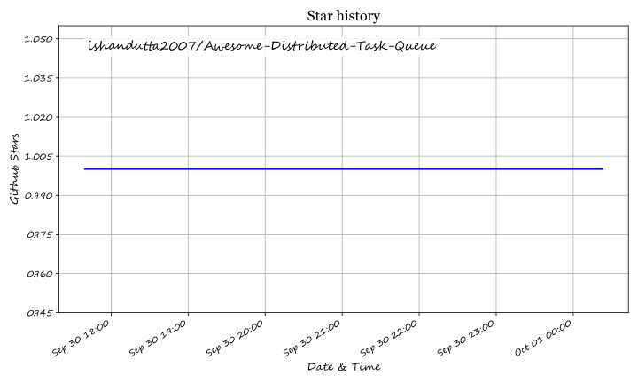

# Awesome-Distributed-Task-Queue

## Top Distributed Task Queue Ecosystem

**Curated List of SaaS Products & Open-Source GitHub Projects**  

*Focused on Background Jobs, Durable Workflows, Reliable Async Execution, Retries & Orchestration for Distributed Systems*  

**Last updated: September 2026**

This repository tracks notable **SaaS platforms** and **open-source projects** for **Distributed Task Queues** and durable workflow engines. These systems run background work reliably—retries, timeouts, fan-out, and long-running processes—across microservices and event-driven architectures.

**Examples** include Temporal Cloud, Trigger.dev, Inngest, Restate, Celery Enterprise, Hatchet, BullMQ Pro, QStash, Cloud Tasks, and IronWorker (the category leaders).

**Open-source emphasis**: This domain is exceptionally strong in open source. **Temporal**, **Celery**, **BullMQ**, **Hatchet**, **RQ**, and related engines power production systems at scale. This section is heavily expanded.

Contributions welcome! Open a PR to add/update entries. Keep descriptions factual and link to official sites.

## Table of Contents

- [SaaS/Hosted Platforms](#saas-hosted-platforms)

- [Open-Source GitHub Projects](#open-source-github-projects)

- [How to Contribute](#how-to-contribute)

- [Disclaimer](#disclaimer)

## SaaS/Hosted Platforms

- **[Temporal Cloud](https://temporal.io/)**  

  Managed durable execution platform—workflows as code with strong reliability guarantees for complex business processes.

- **[Trigger.dev, Inngest, Hatchet Cloud](https://trigger.dev/)**  

  Developer-friendly background job and workflow platforms with modern DX, retries, and observability.

- **[Restate Cloud, QStash, Google Cloud Tasks, IronWorker](https://restate.dev/)**  

  Managed async execution, HTTP-based job queues, and serverless-friendly task infrastructure.

- **[BullMQ Pro, Celery Enterprise offerings](https://bullmq.io/)**  

  Commercial support and enhancements around popular open task-queue cores.

- **[Other commercial task / workflow platforms](https://temporal.io/)**  

  Additional durable execution and job-orchestration services.

## Open-Source GitHub Projects

- **[Temporal](https://github.com/temporalio/temporal)**  

  Leading open-source durable execution engine—workflows as code, automatic retries, timers, and versioning; self-host or use Temporal Cloud.

- **[Celery](https://github.com/celery/celery)**  

  Classic open distributed task queue for Python—Redis/RabbitMQ brokers, scheduling, and a huge production footprint.

- **[BullMQ](https://github.com/taskforcesh/bullmq)**  

  Open Redis-based queue for Node.js—jobs, prioritization, rate limits, and parent-child flows (Pro features available commercially).

- **[Hatchet](https://github.com/hatchet-dev/hatchet)**  

  Open orchestration engine for background tasks, AI agents, and durable workflows—PostgreSQL-backed, multi-language SDKs.

- **[RQ (Redis Queue)](https://github.com/rq/rq)**  

  Simple open Python job queue on Redis—lightweight alternative to Celery for many workloads.

- **[Sidekiq](https://github.com/sidekiq/sidekiq)**  

  Popular open (and commercial) background job processor for Ruby on Redis.

- **[Restate (open source)](https://github.com/restatedev/restate)**  

  Open durable execution and event-driven application framework with strong consistency primitives.

- **[DBOS / River / Faktory & other modern queues](https://github.com/dbos-inc/dbos-transact)**  

  Emerging open durable and Postgres-native task systems alongside classic broker-based queues.

- **[Huey, Dramatiq, Taskiq](https://github.com/coleifer/huey)**  

  Additional open Python task queues for simpler or alternative broker setups.

### Additional Strong Open-Source Options

- **Durable workflows**: Temporal or Hatchet / Restate for long-running, recoverable processes.

- **Python jobs**: Celery or RQ / Dramatiq depending on complexity.

- **Node jobs**: BullMQ.

- **Ruby jobs**: Sidekiq.

- **Composable stacks**: App → open queue SDK → Redis/Postgres/Temporal server → workers + metrics.

- Managed clouds still lead for zero-ops durability and multi-tenant isolation at extreme scale.

**Frameworks for building custom systems**:  

**Temporal** for durable workflows; **Celery** / **BullMQ** / **RQ** for classic task queues; **Hatchet** for modern Postgres-centric orchestration.  

Commercial offerings (Temporal Cloud, Trigger.dev, Inngest, Hatchet Cloud, etc.) reduce operational burden.  

Most teams should start open-source and adopt managed only when ops cost justifies it. Fully open distributed task systems are production-proven at massive scale.

## How to Contribute

1. Fork the repo.

2. Add/edit entries in `README.md` (follow existing format).

3. Include: name, link, 1–2 sentence description, and whether it's SaaS or open-source.

4. Submit PR with a short explanation.

Star the repo if you find it useful!

## Disclaimer

- This is a **community-curated** list — not exhaustive and not an endorsement.

- Incorrect retries or missing idempotency can cause duplicate side effects (charges, emails, writes). Design handlers carefully, use idempotency keys, and monitor dead-letter queues. Durable systems store workflow state—protect that data.

- Open-source engines offer full control but require you to operate brokers, databases, and workers. Managed platforms shift reliability ops to the vendor. Neither replaces careful application-level design for failure modes.

---

**Made for backend engineers, platform teams, and builders of reliable async systems.**  

Let's expand open durable execution and task queues while recognizing the managed convenience that leading commercial platforms deliver.

## Star History

<a href="https://star-history.com/#ishandutta2007/Awesome-Distributed-Task-Queue&Timeline" align="center">
  <picture>
    <source media="(prefers-color-scheme: dark)" srcset="assets/ishandutta2007_Awesome-Distributed-Task-Queue_growth.svg">
    
  </picture>
</a>
